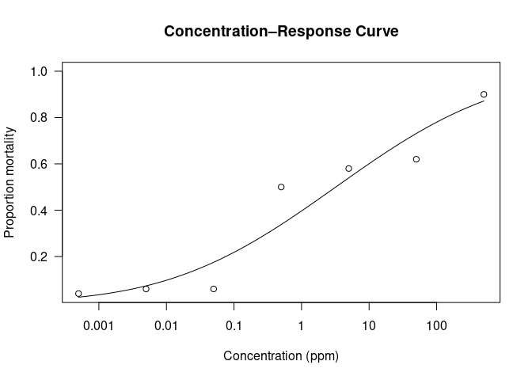
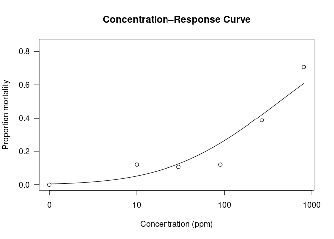
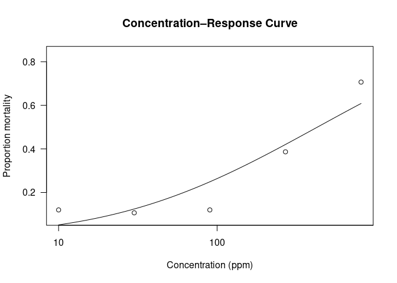
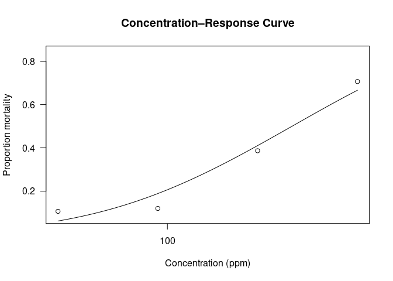
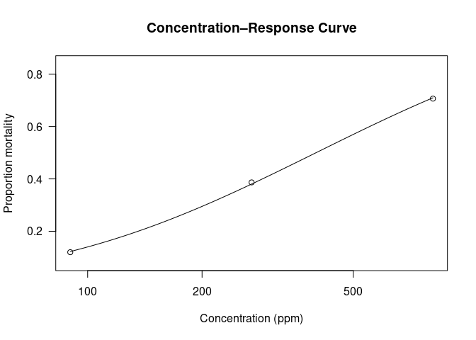

Thad’s Bioassays Probit - LC50 and LC90
================

- [Example](#example)
- [Green (G3), Dec 3rd, 2025: at 36
  hours](#green-g3-dec-3rd-2025-at-36-hours)
- [Green (G4) Feb 10, 2026: 24 hours](#green-g4-feb-10-2026-24-hours)
  - [Including all, including control 0
    ppm](#including-all-including-control-0-ppm)
  - [Excluding control (0 ppm)](#excluding-control-0-ppm)
  - [Excluding control (0 ppm), 10 ppm](#excluding-control-0-ppm-10-ppm)
  - [Excluding control (0 ppm), 10 ppm, 30
    ppm](#excluding-control-0-ppm-10-ppm-30-ppm)

``` r
library(drc)
```

    ## Loading required package: MASS

    ## 
    ## 'drc' has been loaded.

    ## Please cite R and 'drc' if used for a publication,

    ## for references type 'citation()' and 'citation('drc')'.

    ## 
    ## Attaching package: 'drc'

    ## The following objects are masked from 'package:stats':
    ## 
    ##     gaussian, getInitial

``` r
library(tidyr)
library(dplyr)
```

    ## 
    ## Attaching package: 'dplyr'

    ## The following object is masked from 'package:MASS':
    ## 
    ##     select

    ## The following objects are masked from 'package:stats':
    ## 
    ##     filter, lag

    ## The following objects are masked from 'package:base':
    ## 
    ##     intersect, setdiff, setequal, union

# Example

``` r
# Example dataset
data(metallo)

# Fit a probit model
model <- drm(dead/total ~ conc, weights = total, data = metallo,
             fct = LN.2(), type = "binomial")
summary(model)
ED(model, c(50, 90), interval = "delta")  # LC50, LC90, and 95% CIs
```

# Green (G3), Dec 3rd, 2025: at 36 hours

``` r
library(drc)
library(tidyr)
library(dplyr)

# 1. Create dataframe
bioassay <- data.frame(
  conc = c(0.0005, 0.005, 0.05, 0.5, 5, 50, 500),  # concentrations (ppm)
  dead1 = c(1,2,1,14,13,15,20),
  dead2 = c(1,1,2,11,16,16,25),
  total = 25
)

# Convert to long format (one row per replicate)
bioassay_long <- bioassay %>%
  pivot_longer(cols = c(dead1, dead2),
               names_to = "replicate",
               values_to = "dead") %>%
  mutate(total = total)  # total is the same for both rows

bioassay_long
```

    ## # A tibble: 14 × 4
    ##        conc total replicate  dead
    ##       <dbl> <dbl> <chr>     <dbl>
    ##  1   0.0005    25 dead1         1
    ##  2   0.0005    25 dead2         1
    ##  3   0.005     25 dead1         2
    ##  4   0.005     25 dead2         1
    ##  5   0.05      25 dead1         1
    ##  6   0.05      25 dead2         2
    ##  7   0.5       25 dead1        14
    ##  8   0.5       25 dead2        11
    ##  9   5         25 dead1        13
    ## 10   5         25 dead2        16
    ## 11  50         25 dead1        15
    ## 12  50         25 dead2        16
    ## 13 500         25 dead1        20
    ## 14 500         25 dead2        25

``` r
# 2. fit the probit model
model <- drm(dead/total ~ conc, 
             weights = total, 
             data = bioassay_long,
             fct  = LN.2(),     # log-normal 2-parameter model
             type = "binomial")

summary(model)
```

    ## 
    ## Model fitted: Log-normal with lower limit at 0 and upper limit at 1 (2 parms)
    ## 
    ## Parameter estimates:
    ## 
    ##               Estimate Std. Error t-value   p-value    
    ## b:(Intercept) 0.224469   0.021065 10.6560 < 2.2e-16 ***
    ## e:(Intercept) 3.209257   1.175147  2.7309  0.006315 ** 
    ## ---
    ## Signif. codes:  0 '***' 0.001 '**' 0.01 '*' 0.05 '.' 0.1 ' ' 1

``` r
ED(model, c(50, 90), interval = "delta")
```

    ## 
    ## Estimated effective doses
    ## 
    ##          Estimate Std. Error      Lower      Upper
    ## e:1:50    3.20926    1.17515    0.90601    5.51250
    ## e:1:90  968.05894  679.85563 -364.43361 2300.55149

``` r
plot(model, log = "x",
     xlab = "Concentration (ppm)",
     ylab = "Proportion mortality",
     main = "Concentration–Response Curve")
```

<!-- -->

# Green (G4) Feb 10, 2026: 24 hours

## Including all, including control 0 ppm

``` r
# 1. Create dataframe, including Controls (zero deaths FYI)
bioassay <- data.frame(
  conc = c(0, 10,30,90,270,810),  # concentrations (ppm)
  dead1 = c(0, 25-21, 25-23, 25-23, 25-13, 25-11),
  dead2 = c(0, 25-22, 25-23, 25-22, 25-16, 25-4),
  dead3 = c(0, 25-23, 25-21, 25-21, 25-17, 25-7),
  total = 25
)

# Convert to long format (one row per replicate)
bioassay_long <- bioassay %>%
  pivot_longer(cols = c(dead1, dead2, dead3),
               names_to = "replicate",
               values_to = "dead") %>%
  mutate(total = total)  # total is the same for both rows

bioassay_long
```

    ## # A tibble: 18 × 4
    ##     conc total replicate  dead
    ##    <dbl> <dbl> <chr>     <dbl>
    ##  1     0    25 dead1         0
    ##  2     0    25 dead2         0
    ##  3     0    25 dead3         0
    ##  4    10    25 dead1         4
    ##  5    10    25 dead2         3
    ##  6    10    25 dead3         2
    ##  7    30    25 dead1         2
    ##  8    30    25 dead2         2
    ##  9    30    25 dead3         4
    ## 10    90    25 dead1         2
    ## 11    90    25 dead2         3
    ## 12    90    25 dead3         4
    ## 13   270    25 dead1        12
    ## 14   270    25 dead2         9
    ## 15   270    25 dead3         8
    ## 16   810    25 dead1        14
    ## 17   810    25 dead2        21
    ## 18   810    25 dead3        18

``` r
# 2. fit the probit model
model <- drm(dead/total ~ conc, 
             weights = total, 
             data = bioassay_long,
             fct = LN.2(),   # log-normal 2-parameter model
             type = "binomial")

summary(model)
```

    ## 
    ## Model fitted: Log-normal with lower limit at 0 and upper limit at 1 (2 parms)
    ## 
    ## Parameter estimates:
    ## 
    ##                 Estimate Std. Error t-value   p-value    
    ## b:(Intercept)   0.433566   0.051421  8.4317 < 2.2e-16 ***
    ## e:(Intercept) 429.217711  94.106699  4.5610 5.092e-06 ***
    ## ---
    ## Signif. codes:  0 '***' 0.001 '**' 0.01 '*' 0.05 '.' 0.1 ' ' 1

``` r
# 3. Estimate LC50 and LC90
ED(model, c(50, 90), interval = "delta")
```

    ## 
    ## Estimated effective doses
    ## 
    ##         Estimate Std. Error     Lower     Upper
    ## e:1:50   429.218     94.107   244.772   613.663
    ## e:1:90  8248.630   4252.971   -87.041 16584.301

``` r
# 4. Plot the concentration–response curve
plot(model, log = "x",
     xlab = "Concentration (ppm)",
     ylab = "Proportion mortality",
     main = "Concentration–Response Curve")
```

<!-- -->

## Excluding control (0 ppm)

``` r
# 1. Create dataframe, excluding Control (zero deaths FYI)
bioassay <- data.frame(
  conc = c(10,30,90,270,810),  # concentrations (ppm)
  dead1 = c(25-21, 25-23, 25-23, 25-13, 25-11),
  dead2 = c(25-22, 25-23, 25-22, 25-16, 25-4),
  dead3 = c(25-23, 25-21, 25-21, 25-17, 25-7),
  total = 25
)

# Convert to long format (one row per replicate)
bioassay_long <- bioassay %>%
  pivot_longer(cols = c(dead1, dead2, dead3),
               names_to = "replicate",
               values_to = "dead") %>%
  mutate(total = total)  # total is the same for both rows

bioassay_long
```

    ## # A tibble: 15 × 4
    ##     conc total replicate  dead
    ##    <dbl> <dbl> <chr>     <dbl>
    ##  1    10    25 dead1         4
    ##  2    10    25 dead2         3
    ##  3    10    25 dead3         2
    ##  4    30    25 dead1         2
    ##  5    30    25 dead2         2
    ##  6    30    25 dead3         4
    ##  7    90    25 dead1         2
    ##  8    90    25 dead2         3
    ##  9    90    25 dead3         4
    ## 10   270    25 dead1        12
    ## 11   270    25 dead2         9
    ## 12   270    25 dead3         8
    ## 13   810    25 dead1        14
    ## 14   810    25 dead2        21
    ## 15   810    25 dead3        18

``` r
# 2. fit the probit model
model <- drm(dead/total ~ conc, 
             weights = total, 
             data = bioassay_long,
             fct = LN.2(),   # log-normal 2-parameter model
             type = "binomial")

summary(model)
```

    ## 
    ## Model fitted: Log-normal with lower limit at 0 and upper limit at 1 (2 parms)
    ## 
    ## Parameter estimates:
    ## 
    ##                 Estimate Std. Error t-value   p-value    
    ## b:(Intercept)   0.433565   0.051421  8.4316 < 2.2e-16 ***
    ## e:(Intercept) 429.223965  94.110059  4.5609 5.094e-06 ***
    ## ---
    ## Signif. codes:  0 '***' 0.001 '**' 0.01 '*' 0.05 '.' 0.1 ' ' 1

``` r
# 3. Estimate LC50 and LC90
ED(model, c(50, 90), interval = "delta")
```

    ## 
    ## Estimated effective doses
    ## 
    ##         Estimate Std. Error     Lower     Upper
    ## e:1:50   429.224     94.110   244.772   613.676
    ## e:1:90  8248.841   4253.170   -87.219 16584.902

``` r
# 4. Plot the concentration–response curve
plot(model, log = "x",
     xlab = "Concentration (ppm)",
     ylab = "Proportion mortality",
     main = "Concentration–Response Curve")
```

<!-- -->

## Excluding control (0 ppm), 10 ppm

``` r
# 1. Create dataframe, excluding Control (zero deaths FYI)
bioassay <- data.frame(
  conc = c(30,90,270,810),  # concentrations (ppm)
  dead1 = c(25-23, 25-23, 25-13, 25-11),
  dead2 = c(25-23, 25-22, 25-16, 25-4),
  dead3 = c(25-21, 25-21, 25-17, 25-7),
  total = 25
)

# Convert to long format (one row per replicate)
bioassay_long <- bioassay %>%
  pivot_longer(cols = c(dead1, dead2, dead3),
               names_to = "replicate",
               values_to = "dead") %>%
  mutate(total = total)  # total is the same for both rows

bioassay_long
```

    ## # A tibble: 12 × 4
    ##     conc total replicate  dead
    ##    <dbl> <dbl> <chr>     <dbl>
    ##  1    30    25 dead1         2
    ##  2    30    25 dead2         2
    ##  3    30    25 dead3         4
    ##  4    90    25 dead1         2
    ##  5    90    25 dead2         3
    ##  6    90    25 dead3         4
    ##  7   270    25 dead1        12
    ##  8   270    25 dead2         9
    ##  9   270    25 dead3         8
    ## 10   810    25 dead1        14
    ## 11   810    25 dead2        21
    ## 12   810    25 dead3        18

``` r
# 2. fit the probit model
model <- drm(dead/total ~ conc, 
             weights = total, 
             data = bioassay_long,
             fct = LN.2(),   # log-normal 2-parameter model
             type = "binomial")

summary(model)
```

    ## 
    ## Model fitted: Log-normal with lower limit at 0 and upper limit at 1 (2 parms)
    ## 
    ## Parameter estimates:
    ## 
    ##                 Estimate Std. Error t-value   p-value    
    ## b:(Intercept)   0.597008   0.072826  8.1977 2.335e-16 ***
    ## e:(Intercept) 394.382423  62.372298  6.3230 2.565e-10 ***
    ## ---
    ## Signif. codes:  0 '***' 0.001 '**' 0.01 '*' 0.05 '.' 0.1 ' ' 1

``` r
# 3. Estimate LC50 and LC90
ED(model, c(50, 90), interval = "delta")
```

    ## 
    ## Estimated effective doses
    ## 
    ##        Estimate Std. Error    Lower    Upper
    ## e:1:50  394.382     62.372  272.135  516.630
    ## e:1:90 3374.305   1232.592  958.469 5790.140

``` r
# 4. Plot the concentration–response curve
plot(model, log = "x",
     xlab = "Concentration (ppm)",
     ylab = "Proportion mortality",
     main = "Concentration–Response Curve")
```

<!-- -->

## Excluding control (0 ppm), 10 ppm, 30 ppm

``` r
# 1. Create dataframe, excluding 10 ppm, 30 ppm
bioassay <- data.frame(
  conc = c(90,270,810),  # concentrations (ppm)
  dead1 = c(25-23, 25-13, 25-11),
  dead2 = c(25-22, 25-16, 25-4),
  dead3 = c(25-21, 25-17, 25-7),
  total = 25
)

# Convert to long format (one row per replicate)
bioassay_long <- bioassay %>%
  pivot_longer(cols = c(dead1, dead2, dead3),
               names_to = "replicate",
               values_to = "dead") %>%
  mutate(total = total)  # total is the same for both rows

bioassay_long
```

    ## # A tibble: 9 × 4
    ##    conc total replicate  dead
    ##   <dbl> <dbl> <chr>     <dbl>
    ## 1    90    25 dead1         2
    ## 2    90    25 dead2         3
    ## 3    90    25 dead3         4
    ## 4   270    25 dead1        12
    ## 5   270    25 dead2         9
    ## 6   270    25 dead3         8
    ## 7   810    25 dead1        14
    ## 8   810    25 dead2        21
    ## 9   810    25 dead3        18

``` r
# 2. fit the probit model
model <- drm(dead/total ~ conc, 
             weights = total, 
             data = bioassay_long,
             fct = LN.2(),   # log-normal 2-parameter model
             type = "binomial")

summary(model)
```

    ## 
    ## Model fitted: Log-normal with lower limit at 0 and upper limit at 1 (2 parms)
    ## 
    ## Parameter estimates:
    ## 
    ##                Estimate Std. Error t-value   p-value    
    ## b:(Intercept)   0.78040    0.10901  7.1590 8.126e-13 ***
    ## e:(Intercept) 398.86313   49.27650  8.0944 6.208e-16 ***
    ## ---
    ## Signif. codes:  0 '***' 0.001 '**' 0.01 '*' 0.05 '.' 0.1 ' ' 1

``` r
# 3. Estimate LC50 and LC90
ED(model, c(50, 90), interval = "delta")
```

    ## 
    ## Estimated effective doses
    ## 
    ##        Estimate Std. Error    Lower    Upper
    ## e:1:50  398.863     49.277  302.283  495.443
    ## e:1:90 2060.678    598.845  886.964 3234.391

``` r
# 4. Plot the concentration–response curve
plot(model, log = "x",
     xlab = "Concentration (ppm)",
     ylab = "Proportion mortality",
     main = "Concentration–Response Curve")
```

<!-- -->
