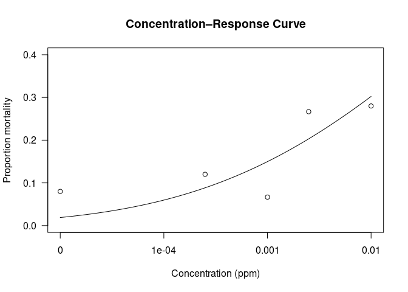

Your Title
================

- [Example](#example)
- [Green, Oct 23rd, at 24 hours](#green-oct-23rd-at-24-hours)
- [Green, Oct 8, 24 hours](#green-oct-8-24-hours)

# Example

``` r
library(drc)
library(tidyr)
library(dplyr)

# Example dataset
data(metallo)


# Fit a probit model
model <- drm(dead/total ~ conc, weights = total, data = metallo,
             fct = LN.2(), type = "binomial")
summary(model)
ED(model, c(50, 90), interval = "delta")  # LC50, LC90, and 95% CIs
```

# Green, Oct 23rd, at 24 hours

``` r
library(drc)
```

    ## Loading required package: MASS

    ## 
    ## 'drc' has been loaded.

    ## Please cite R and 'drc' if used for a publication,

    ## for references type 'citation()' and 'citation('drc')'.

    ## 
    ## Attaching package: 'drc'

    ## The following objects are masked from 'package:stats':
    ## 
    ##     gaussian, getInitial

``` r
library(tidyr)
library(dplyr)
```

    ## 
    ## Attaching package: 'dplyr'

    ## The following object is masked from 'package:MASS':
    ## 
    ##     select

    ## The following objects are masked from 'package:stats':
    ## 
    ##     filter, lag

    ## The following objects are masked from 'package:base':
    ## 
    ##     intersect, setdiff, setequal, union

``` r
# 1. Create dataframe
bioassay <- data.frame(
  conc = c(0, 0.00025, 0.001, 0.0025, 0.01),  # concentrations (ppm)
  dead1 = c(1, 3, 2, 7, 2),
  dead2 = c(0, 3, 2, 0, 9),
  dead3 = c(6, 5, 7, 4, 10),
  total = 25
)

# Convert to long format (one row per replicate)
bioassay_long <- data.frame(
  conc  = rep(bioassay$conc, each = 3),
  dead  = c(bioassay$dead1, bioassay$dead2, bioassay$dead3),
  total = rep(bioassay$total, each = 3)
)

bioassay_long
```

    ##       conc dead total
    ## 1  0.00000    1    25
    ## 2  0.00000    3    25
    ## 3  0.00000    2    25
    ## 4  0.00025    7    25
    ## 5  0.00025    2    25
    ## 6  0.00025    0    25
    ## 7  0.00100    3    25
    ## 8  0.00100    2    25
    ## 9  0.00100    0    25
    ## 10 0.00250    9    25
    ## 11 0.00250    6    25
    ## 12 0.00250    5    25
    ## 13 0.01000    7    25
    ## 14 0.01000    4    25
    ## 15 0.01000   10    25

``` r
# 2. fit the probit model

model <- drm(dead/total ~ conc, 
             weights = total, 
             data = bioassay_long,
             fct = LN.2(),   # log-normal 2-parameter model
             type = "binomial")

summary(model)
```

    ## 
    ## Model fitted: Log-normal with lower limit at 0 and upper limit at 1 (2 parms)
    ## 
    ## Parameter estimates:
    ## 
    ##               Estimate Std. Error t-value  p-value    
    ## b:(Intercept) 0.225706   0.053608  4.2103 2.55e-05 ***
    ## e:(Intercept) 0.099091   0.094368  1.0500   0.2937    
    ## ---
    ## Signif. codes:  0 '***' 0.001 '**' 0.01 '*' 0.05 '.' 0.1 ' ' 1

``` r
# 3. Estimate LC50 and LC90
ED(model, c(50, 90), interval = "delta")
```

    ## 
    ## Estimated effective doses
    ## 
    ##          Estimate Std. Error      Lower      Upper
    ## e:1:50   0.099091   0.094368  -0.085867   0.284049
    ## e:1:90  28.969571  65.352968 -99.119892 157.059034

``` r
# 4. Plot the concentration–response curve
plot(model, log = "x",
     xlab = "Concentration (ppm)",
     ylab = "Proportion mortality",
     main = "Concentration–Response Curve")
```

<!-- -->

Interpretation of these results: the slope parameter (b) is highly
significant (p \< 0.001),

but the LC₅₀ parameter (e) is not statistically significant (p = 0.29).

Let’s unpack that precisely:

1.  Understanding the parameters Parameter Meaning Estimate
    Interpretation b:(Intercept) slope of the probit/log-normal curve
    0.226 ± 0.054 Significant (p \< 0.001) → there is a measurable
    change in mortality with concentration. The positive slope indicates
    increasing mortality with dose. e:(Intercept) log₁₀(LC₅₀) 0.099 ±
    0.094 Not significant (p = 0.29). This means the estimated LC₅₀ (≈
    10^0.099 ≈ 1.26 ppm) is imprecise—its confidence interval still
    overlaps very low values.

# Green, Oct 8, 24 hours

``` r
# 1. Create dataframe
bioassay <- data.frame(
  conc = c(0, 0.0025, 0.025),  # concentrations (ppm)
  dead1 = c(25-24, 25-3, 25-9),
  dead2 = c(25-24, 25-3, 25-4),
  dead3 = c(25-23, 25-3, 25-5),
  total = 25
)

# Convert to long format (one row per replicate)
bioassay_long <- data.frame(
  conc  = rep(bioassay$conc, each = 3),
  dead  = c(bioassay$dead1, bioassay$dead2, bioassay$dead3),
  total = rep(bioassay$total, each = 3)
)

bioassay_long

# 2. fit the probit model
model <- drm(dead/total ~ conc, 
             weights = total, 
             data = bioassay_long,
             fct = LN.2(),   # log-normal 2-parameter model
             type = "binomial")

summary(model)

# 3. Estimate LC50 and LC90
ED(model, c(50, 90), interval = "delta")

# 4. Plot the concentration–response curve
plot(model, log = "x",
     xlab = "Concentration (ppm)",
     ylab = "Proportion mortality",
     main = "Concentration–Response Curve")
```
