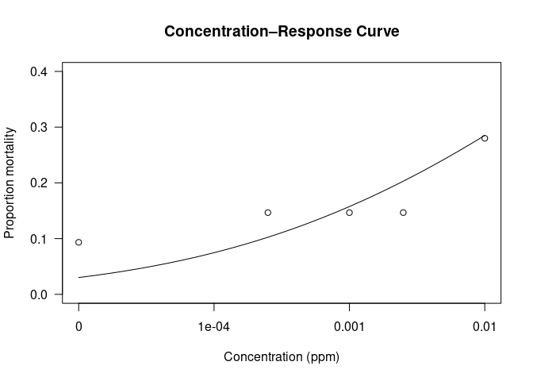
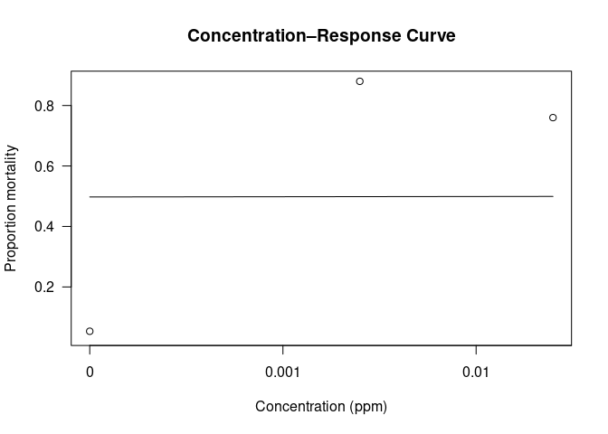
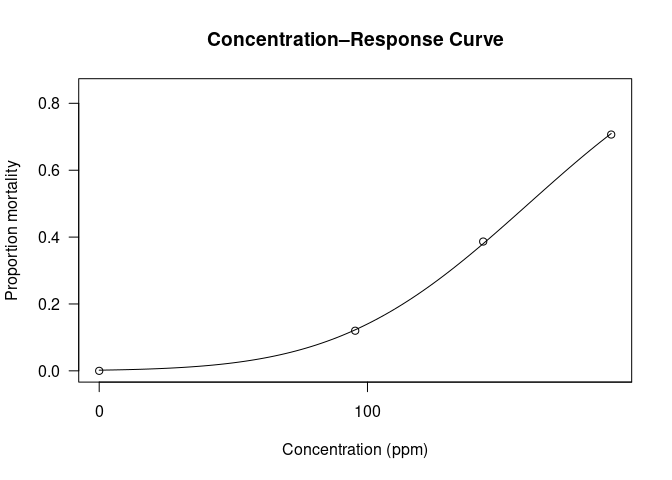

Bioassays Probit - LC50 and LC90
================
Norah Saarman
2026-06-09

- [Example](#example)
- [Green, Oct 23rd, 2025: at 24 hours](#green-oct-23rd-2025-at-24-hours)
- [Green, Oct 8, 2025: 24 hours](#green-oct-8-2025-24-hours)
- [Green, Dec 3rd, 2025: at 36 hours](#green-dec-3rd-2025-at-36-hours)
- [Green (G4) Feb 10, 2026: 24 hours](#green-g4-feb-10-2026-24-hours)
  - [Including all, including control 0
    ppm](#including-all-including-control-0-ppm)
  - [Excluding control (0 ppm)](#excluding-control-0-ppm)

RStudio Configuration: - **R version:** R 4.4.0 (Geospatial packages)  
- **Number of cores:** 4 (up to 32 available)  
- **Account:** saarman-np  
- **Partition:** saarman-np (now auto allows multiple simultaneous
jobs)  
- **Memory per job:** 16G (cluster limit: 1000G total; avoid exceeding
half)

``` r
library(drc)
```

    ## Loading required package: MASS

    ## 
    ## 'drc' has been loaded.

    ## Please cite R and 'drc' if used for a publication,

    ## for references type 'citation()' and 'citation('drc')'.

    ## 
    ## Attaching package: 'drc'

    ## The following objects are masked from 'package:stats':
    ## 
    ##     gaussian, getInitial

``` r
library(tidyr)
library(dplyr)
```

    ## 
    ## Attaching package: 'dplyr'

    ## The following object is masked from 'package:MASS':
    ## 
    ##     select

    ## The following objects are masked from 'package:stats':
    ## 
    ##     filter, lag

    ## The following objects are masked from 'package:base':
    ## 
    ##     intersect, setdiff, setequal, union

# Example

``` r
# Example dataset
data(metallo)

# Fit a probit model
model <- drm(dead/total ~ conc, weights = total, data = metallo,
             fct = LN.2(), type = "binomial")
summary(model)
ED(model, c(50, 90), interval = "delta")  # LC50, LC90, and 95% CIs
```

# Green, Oct 23rd, 2025: at 24 hours

``` r
library(drc)
library(tidyr)
library(dplyr)

# 1. Create dataframe
bioassay <- data.frame(
  conc = c(0, 0.00025, 0.001, 0.0025, 0.01),  # concentrations (ppm)
  dead1 = c(1, 3, 2, 7, 2),
  dead2 = c(0, 3, 2, 0, 9),
  dead3 = c(6, 5, 7, 4, 10),
  total = 25
)

# Convert to long format (one row per replicate)
bioassay_long <- data.frame(
  conc  = rep(bioassay$conc,3),
  dead  = c(bioassay$dead1, bioassay$dead2, bioassay$dead3),
  total = rep(bioassay$total,3)
)

bioassay_long
```

    ##       conc dead total
    ## 1  0.00000    1    25
    ## 2  0.00025    3    25
    ## 3  0.00100    2    25
    ## 4  0.00250    7    25
    ## 5  0.01000    2    25
    ## 6  0.00000    0    25
    ## 7  0.00025    3    25
    ## 8  0.00100    2    25
    ## 9  0.00250    0    25
    ## 10 0.01000    9    25
    ## 11 0.00000    6    25
    ## 12 0.00025    5    25
    ## 13 0.00100    7    25
    ## 14 0.00250    4    25
    ## 15 0.01000   10    25

``` r
# 2. fit the probit model

model <- drm(dead/total ~ conc, 
             weights = total, 
             data = bioassay_long,
             fct = LN.2(),   # log-normal 2-parameter model
             type = "binomial")

summary(model)
```

    ## 
    ## Model fitted: Log-normal with lower limit at 0 and upper limit at 1 (2 parms)
    ## 
    ## Parameter estimates:
    ## 
    ##               Estimate Std. Error t-value   p-value    
    ## b:(Intercept) 0.189653   0.038057  4.9834 6.249e-07 ***
    ## e:(Intercept) 0.199673   0.182862  1.0919    0.2749    
    ## ---
    ## Signif. codes:  0 '***' 0.001 '**' 0.01 '*' 0.05 '.' 0.1 ' ' 1

``` r
# 3. Estimate LC50 and LC90
ED(model, c(50, 90), interval = "delta")
```

    ## 
    ## Estimated effective doses
    ## 
    ##          Estimate Std. Error      Lower      Upper
    ## e:1:50    0.19967    0.18286   -0.15873    0.55808
    ## e:1:90  171.78948  379.41514 -571.85053  915.42948

``` r
# 4. Plot the concentration–response curve
plot(model, log = "x",
     xlab = "Concentration (ppm)",
     ylab = "Proportion mortality",
     main = "Concentration–Response Curve")
```

<!-- -->

Interpretation of these results: the slope parameter (b) is highly
significant (p \< 0.001),

but the LC₅₀ parameter (e) is not statistically significant (p = 0.29).

Understanding the parameters: Parameter Meaning Estimate Interpretation
b:(Intercept) slope of the probit/log-normal curve 0.226 ± 0.054
Significant (p \< 0.001) → there is a measurable change in mortality
with concentration. The positive slope indicates increasing mortality
with dose. e:(Intercept) log₁₀(LC₅₀) 0.099 ± 0.094 Not significant (p =
0.29). This means the estimated LC₅₀ (≈ 10^0.099 ≈ 1.26 ppm) is
imprecise—its confidence interval still overlaps very low values.

# Green, Oct 8, 2025: 24 hours

``` r
# 1. Create dataframe
bioassay <- data.frame(
  conc = c(0, 0.0025, 0.025),  # concentrations (ppm)
  dead1 = c(25-24, 25-3, 25-9),
  dead2 = c(25-24, 25-3, 25-4),
  dead3 = c(25-23, 25-3, 25-5),
  total = 25
)

# Convert to long format (one row per replicate)
bioassay_long <- data.frame(
  conc  = rep(bioassay$conc, 3),
  dead  = c(bioassay$dead1, bioassay$dead2, bioassay$dead3),
  total = rep(bioassay$total, 3)
)

bioassay_long
```

    ##     conc dead total
    ## 1 0.0000    1    25
    ## 2 0.0025   22    25
    ## 3 0.0250   16    25
    ## 4 0.0000    1    25
    ## 5 0.0025   22    25
    ## 6 0.0250   21    25
    ## 7 0.0000    2    25
    ## 8 0.0025   22    25
    ## 9 0.0250   20    25

``` r
# 2. fit the probit model
model <- drm(dead/total ~ conc, 
             weights = total, 
             data = bioassay_long,
             fct = LN.2(),   # log-normal 2-parameter model
             type = "binomial")

summary(model)
```

    ## Warning in sqrt(diag(varMat)): NaNs produced

    ## 
    ## Model fitted: Log-normal with lower limit at 0 and upper limit at 1 (2 parms)
    ## 
    ## Parameter estimates:
    ## 
    ##                 Estimate Std. Error t-value   p-value    
    ## b:(Intercept) 8.2457e-04 4.2351e-05   19.47 < 2.2e-16 ***
    ## e:(Intercept) 1.9133e-01        NaN     NaN       NaN    
    ## ---
    ## Signif. codes:  0 '***' 0.001 '**' 0.01 '*' 0.05 '.' 0.1 ' ' 1

``` r
# 3. Estimate LC50 and LC90
ED(model, c(50, 90), interval = "delta")
```

    ## Warning in sqrt(dEDval %*% varCov %*% dEDval): NaNs produced

    ## Warning in sqrt(dEDval %*% varCov %*% dEDval): NaNs produced

    ## 
    ## Estimated effective doses
    ## 
    ##        Estimate Std. Error Lower Upper
    ## e:1:50  0.19133        NaN   NaN   NaN
    ## e:1:90      Inf        NaN   NaN   NaN

``` r
# 4. Plot the concentration–response curve
plot(model, log = "x",
     xlab = "Concentration (ppm)",
     ylab = "Proportion mortality",
     main = "Concentration–Response Curve")
```

<!-- -->

# Green, Dec 3rd, 2025: at 36 hours

``` r
library(drc)
library(tidyr)
library(dplyr)

# 1. Create dataframe
bioassay <- data.frame(
  conc = c(0.0005, 0.005, 0.05, 0.5, 5, 50, 500),  # concentrations (ppm)
  dead1 = c(1,2,1,14,13,15,20),
  dead2 = c(1,1,2,11,16,16,25),
  total = 25
)

# Convert to long format (one row per replicate)
bioassay_long <- bioassay %>%
  pivot_longer(cols = c(dead1, dead2),
               names_to = "replicate",
               values_to = "dead") %>%
  mutate(total = total)  # total is the same for both rows

bioassay_long
```

    ## # A tibble: 14 × 4
    ##        conc total replicate  dead
    ##       <dbl> <dbl> <chr>     <dbl>
    ##  1   0.0005    25 dead1         1
    ##  2   0.0005    25 dead2         1
    ##  3   0.005     25 dead1         2
    ##  4   0.005     25 dead2         1
    ##  5   0.05      25 dead1         1
    ##  6   0.05      25 dead2         2
    ##  7   0.5       25 dead1        14
    ##  8   0.5       25 dead2        11
    ##  9   5         25 dead1        13
    ## 10   5         25 dead2        16
    ## 11  50         25 dead1        15
    ## 12  50         25 dead2        16
    ## 13 500         25 dead1        20
    ## 14 500         25 dead2        25

``` r
# 2. fit the probit model
model <- drm(dead/total ~ conc, 
             weights = total, 
             data = bioassay_long,
             fct  = LN.2(),     # log-normal 2-parameter model
             type = "binomial")

summary(model)
```

    ## 
    ## Model fitted: Log-normal with lower limit at 0 and upper limit at 1 (2 parms)
    ## 
    ## Parameter estimates:
    ## 
    ##               Estimate Std. Error t-value   p-value    
    ## b:(Intercept) 0.224469   0.021065 10.6560 < 2.2e-16 ***
    ## e:(Intercept) 3.209257   1.175147  2.7309  0.006315 ** 
    ## ---
    ## Signif. codes:  0 '***' 0.001 '**' 0.01 '*' 0.05 '.' 0.1 ' ' 1

``` r
ED(model, c(50, 90), interval = "delta")
```

    ## 
    ## Estimated effective doses
    ## 
    ##          Estimate Std. Error      Lower      Upper
    ## e:1:50    3.20926    1.17515    0.90601    5.51250
    ## e:1:90  968.05894  679.85563 -364.43361 2300.55148

``` r
plot(model, log = "x",
     xlab = "Concentration (ppm)",
     ylab = "Proportion mortality",
     main = "Concentration–Response Curve")
```

<!-- -->

# Green (G4) Feb 10, 2026: 24 hours

## Including all, including control 0 ppm

``` r
# 1. Create dataframe, including Controls (zero deaths FYI)
bioassay <- data.frame(
  conc = c(0, 10,30,90,270,810),  # concentrations (ppm)
  dead1 = c(0, 25-21, 25-23, 25-23, 25-13, 25-11),
  dead2 = c(0, 25-22, 25-23, 25-22, 25-16, 25-4),
  dead3 = c(0, 25-23, 25-21, 25-21, 25-17, 25-7),
  total = 25
)

# Convert to long format (one row per replicate)
bioassay_long <- bioassay %>%
  pivot_longer(cols = c(dead1, dead2, dead3),
               names_to = "replicate",
               values_to = "dead") %>%
  mutate(total = total)  # total is the same for both rows

bioassay_long
```

    ## # A tibble: 18 × 4
    ##     conc total replicate  dead
    ##    <dbl> <dbl> <chr>     <dbl>
    ##  1     0    25 dead1         0
    ##  2     0    25 dead2         0
    ##  3     0    25 dead3         0
    ##  4    10    25 dead1         4
    ##  5    10    25 dead2         3
    ##  6    10    25 dead3         2
    ##  7    30    25 dead1         2
    ##  8    30    25 dead2         2
    ##  9    30    25 dead3         4
    ## 10    90    25 dead1         2
    ## 11    90    25 dead2         3
    ## 12    90    25 dead3         4
    ## 13   270    25 dead1        12
    ## 14   270    25 dead2         9
    ## 15   270    25 dead3         8
    ## 16   810    25 dead1        14
    ## 17   810    25 dead2        21
    ## 18   810    25 dead3        18

``` r
# 2. fit the probit model
model <- drm(dead/total ~ conc, 
             weights = total, 
             data = bioassay_long,
             fct = LN.2(),   # log-normal 2-parameter model
             type = "binomial")

summary(model)
```

    ## 
    ## Model fitted: Log-normal with lower limit at 0 and upper limit at 1 (2 parms)
    ## 
    ## Parameter estimates:
    ## 
    ##                 Estimate Std. Error t-value   p-value    
    ## b:(Intercept)   0.433566   0.051421  8.4317 < 2.2e-16 ***
    ## e:(Intercept) 429.217711  94.106679  4.5610 5.092e-06 ***
    ## ---
    ## Signif. codes:  0 '***' 0.001 '**' 0.01 '*' 0.05 '.' 0.1 ' ' 1

``` r
# 3. Estimate LC50 and LC90
ED(model, c(50, 90), interval = "delta")
```

    ## 
    ## Estimated effective doses
    ## 
    ##         Estimate Std. Error     Lower     Upper
    ## e:1:50   429.218     94.107   244.772   613.663
    ## e:1:90  8248.630   4252.971   -87.039 16584.299

``` r
# 4. Plot the concentration–response curve
plot(model, log = "x",
     xlab = "Concentration (ppm)",
     ylab = "Proportion mortality",
     main = "Concentration–Response Curve")
```

<!-- -->

## Excluding control (0 ppm)

``` r
# 1. Create dataframe, excluding Control (zero deaths FYI)
bioassay <- data.frame(
  conc = c(10,30,90,270,810),  # concentrations (ppm)
  dead1 = c(25-21, 25-23, 25-23, 25-13, 25-11),
  dead2 = c(25-22, 25-23, 25-22, 25-16, 25-4),
  dead3 = c(25-23, 25-21, 25-21, 25-17, 25-7),
  total = 25
)

# Convert to long format (one row per replicate)
bioassay_long <- bioassay %>%
  pivot_longer(cols = c(dead1, dead2, dead3),
               names_to = "replicate",
               values_to = "dead") %>%
  mutate(total = total)  # total is the same for both rows

bioassay_long
```

    ## # A tibble: 15 × 4
    ##     conc total replicate  dead
    ##    <dbl> <dbl> <chr>     <dbl>
    ##  1    10    25 dead1         4
    ##  2    10    25 dead2         3
    ##  3    10    25 dead3         2
    ##  4    30    25 dead1         2
    ##  5    30    25 dead2         2
    ##  6    30    25 dead3         4
    ##  7    90    25 dead1         2
    ##  8    90    25 dead2         3
    ##  9    90    25 dead3         4
    ## 10   270    25 dead1        12
    ## 11   270    25 dead2         9
    ## 12   270    25 dead3         8
    ## 13   810    25 dead1        14
    ## 14   810    25 dead2        21
    ## 15   810    25 dead3        18

``` r
# 2. fit the probit model
model <- drm(dead/total ~ conc, 
             weights = total, 
             data = bioassay_long,
             fct = LN.2(),   # log-normal 2-parameter model
             type = "binomial")

summary(model)
```

    ## 
    ## Model fitted: Log-normal with lower limit at 0 and upper limit at 1 (2 parms)
    ## 
    ## Parameter estimates:
    ## 
    ##                 Estimate Std. Error t-value   p-value    
    ## b:(Intercept)   0.433565   0.051421  8.4316 < 2.2e-16 ***
    ## e:(Intercept) 429.223965  94.110070  4.5609 5.094e-06 ***
    ## ---
    ## Signif. codes:  0 '***' 0.001 '**' 0.01 '*' 0.05 '.' 0.1 ' ' 1

``` r
# 3. Estimate LC50 and LC90
ED(model, c(50, 90), interval = "delta")
```

    ## 
    ## Estimated effective doses
    ## 
    ##        Estimate Std. Error    Lower    Upper
    ## e:1:50   429.22      94.11   244.77   613.68
    ## e:1:90  8248.84    4253.17   -87.22 16584.90

``` r
# 4. Plot the concentration–response curve
plot(model, log = "x",
     xlab = "Concentration (ppm)",
     ylab = "Proportion mortality",
     main = "Concentration–Response Curve")
```

<!-- --> \## Excluding
10, 30 ppm

``` r
# 1. Create dataframe, excluding 10 ppm, 30 ppm
bioassay <- data.frame(
  conc = c(0, 90,270,810),  # concentrations (ppm)
  dead1 = c(0, 25-23, 25-13, 25-11),
  dead2 = c(0, 25-22, 25-16, 25-4),
  dead3 = c(0, 25-21, 25-17, 25-7),
  total = 25
)

# Convert to long format (one row per replicate)
bioassay_long <- bioassay %>%
  pivot_longer(cols = c(dead1, dead2, dead3),
               names_to = "replicate",
               values_to = "dead") %>%
  mutate(total = total)  # total is the same for both rows

bioassay_long
```

    ## # A tibble: 12 × 4
    ##     conc total replicate  dead
    ##    <dbl> <dbl> <chr>     <dbl>
    ##  1     0    25 dead1         0
    ##  2     0    25 dead2         0
    ##  3     0    25 dead3         0
    ##  4    90    25 dead1         2
    ##  5    90    25 dead2         3
    ##  6    90    25 dead3         4
    ##  7   270    25 dead1        12
    ##  8   270    25 dead2         9
    ##  9   270    25 dead3         8
    ## 10   810    25 dead1        14
    ## 11   810    25 dead2        21
    ## 12   810    25 dead3        18

``` r
# 2. fit the probit model
model <- drm(dead/total ~ conc, 
             weights = total, 
             data = bioassay_long,
             fct = LN.2(),   # log-normal 2-parameter model
             type = "binomial")

summary(model)
```

    ## 
    ## Model fitted: Log-normal with lower limit at 0 and upper limit at 1 (2 parms)
    ## 
    ## Parameter estimates:
    ## 
    ##                Estimate Std. Error t-value   p-value    
    ## b:(Intercept)   0.78017    0.10901  7.1572 8.236e-13 ***
    ## e:(Intercept) 398.91110   49.29970  8.0916 6.276e-16 ***
    ## ---
    ## Signif. codes:  0 '***' 0.001 '**' 0.01 '*' 0.05 '.' 0.1 ' ' 1

``` r
# 3. Estimate LC50 and LC90
ED(model, c(50, 90), interval = "delta")
```

    ## 
    ## Estimated effective doses
    ## 
    ##        Estimate Std. Error   Lower   Upper
    ## e:1:50   398.91      49.30  302.29  495.54
    ## e:1:90  2061.93     599.55  886.84 3237.02

``` r
# 4. Plot the concentration–response curve
plot(model, log = "x",
     xlab = "Concentration (ppm)",
     ylab = "Proportion mortality",
     main = "Concentration–Response Curve")
```

<!-- -->
